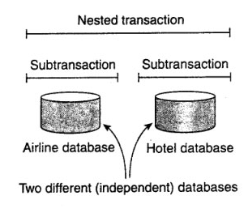

### **Introduction to Distributed Systems**

Distributed systems are crucial for modern computing, enabling multiple independent computers to work together seamlessly as a single system.

There are two major types of distributed systems we'll cover today:
1. **Distributed Computing Systems**
2. **Distributed Information Systems**

---

### **1. Distributed Computing Systems**

**Distributed Computing Systems** consist of a group of independent computers that collaborate to solve computational problems. 

The two most common types are:

- **Cluster Computing Systems**
- **Grid Computing Systems**

---

### **Cluster Computing Systems**

A **Cluster Computing System** is a collection of interconnected computers, known as nodes, working together as a single, unified system. These systems are typically located within the same physical location, often linked by a local network.

Key features include:
- **High Availability**: If one node fails, others can take over the tasks.
- **Parallel Processing**: Tasks can be divided and executed concurrently to enhance performance.
- **Homogeneous Environment**: Usually, all nodes in the cluster have similar hardware and software configurations.

Cluster computing is commonly used in applications requiring high processing power, like weather forecasting, scientific simulations, and large-scale data processing.

---

### **Grid Computing Systems**

**Grid Computing Systems** are similar in concept to cluster computing but on a much larger and more distributed scale. Here, geographically dispersed computers, often with heterogeneous hardware and software configurations, are interconnected to share resources and collaborate on complex tasks.

Key characteristics:
- **Resource Sharing**: Grid systems allow unused computing power from different locations to be pooled together.
- **Heterogeneity**: The participating systems can vary significantly in architecture and location.
- **Wide-area Distribution**: The resources are not confined to a single location; they could span different cities or even continents.

Applications include:
- Solving large scientific problems like protein folding or climate modeling.
- Supporting large-scale virtual organizations or enterprises.


### Summary of the Four Layers in Grid Computing:

1. **Fabric Layer**: Deals with physical resources (e.g., CPUs, storage, networks), abstracting hardware-specific details.
2. **Resource Layer**: Manages individual resource access, monitoring, and local resource allocation.
3. **Connectivity Layer**: Ensures secure communication and authentication between distributed resources.
4. **Collective Layer**: Coordinates grid-wide activities such as resource discovery, job scheduling, and data management.

---

### **2. Distributed Information Systems**

Next, we have **Distributed Information Systems**, which are designed to distribute, manage, and process data across different locations, allowing information to be available globally and in real-time.

There are two key types of distributed information systems:
1. **Transaction Processing Systems**
2. **Enterprise Application Integration (EAI)**

---

### **Transaction Processing Systems (TPS)**

**Transaction Processing Systems (TPS)** manage and process transactions, ensuring they are executed in a reliable, efficient, and secure manner. These systems are typically found in environments requiring high availability and consistency, like banking, e-commerce, and inventory management.

Core features include:
- **ACID Properties**: Ensures transactions are **Atomic**, **Consistent**, **Isolated**, and **Durable**.
- **Fault Tolerance**: Transactions can recover from system failures without data loss.
- **Concurrency Control**: Multiple transactions can occur simultaneously without interfering with each other.

Examples include ATM systems, online shopping carts, and airline booking systems.

---

### ACID Properties

1. **Atomicity**: Ensures that a transaction is treated as a single unit of work, meaning it either completes entirely or not at all.

2. **Consistency**: Guarantees that a transaction brings the database from one valid state to another, adhering to all predefined rules and constraints.

3. **Isolation**: Ensures that transactions operate independently, so that concurrent transactions do not interfere with each other, maintaining data integrity.

4. **Durability**: Guarantees that once a transaction is committed, its changes are permanent and will survive any subsequent system failures. 

These properties are crucial for reliable transaction processing in database systems.
---

``` 
    BEGIN-TRANSACTION
    READ
    WRITE
    ...
    END-TRANSACTION = COMMIT
    ABORT
```

### Nested Transactions in Distributed Systems:

In **distributed systems**, where different parts of the transaction may involve separate databases or services, nested transactions are critical for managing the complexity of coordinating actions across multiple sites. Each subtransaction can correspond to an operation on a different database or service, and failures in one system can be handled without affecting others.

For instance, in a **distributed e-commerce system**, an order transaction might involve:

1. Subtransaction for **payment processing** (handled by a financial service).
2. Subtransaction for **inventory update** (handled by a warehouse system).
3. Subtransaction for **shipping order creation** (handled by a logistics service).

Each of these services may operate independently, and using nested transactions ensures that errors in one service don’t crash the entire order processing system.

---

### **Transaction Processing (TP) Monitor**

A **Transaction Processing Monitor (TP Monitor)** is middleware that sits between client applications and database servers to manage and coordinate transactions. It is responsible for ensuring the integrity, consistency, and security of transactions, particularly in multi-user, distributed environments where multiple clients access shared resources.

#### Key Functions of a TP Monitor:
1. **Transaction Coordination**: It ensures that a transaction is **atomic** (all-or-nothing) and ensures **consistency**, even in distributed environments. This means coordinating multiple databases, servers, or services involved in a single transaction.
2. **Concurrency Control**: TP monitors manage concurrent access to shared resources to avoid issues like deadlocks, race conditions, or inconsistent data.
3. **Load Balancing and Scalability**: TP monitors balance workloads across multiple servers, improving scalability and performance by distributing client requests efficiently.
4. **Resource Management**: They manage system resources (CPU, memory, I/O) to ensure that transactions do not exceed the available resources.
5. **Recovery and Rollback**: In case of failures, TP monitors can **rollback** incomplete transactions, ensuring the database returns to a consistent state.
6. **Security**: TP Monitors ensure that only authorized users can initiate transactions and access resources, enforcing security policies.

#### Popular TP Monitors:
- **IBM CICS (Customer Information Control System)**
- **BEA Tuxedo**
- **Microsoft Transaction Server (MTS)**
- **Oracle Tuxedo**

#### Example Use Case:
Imagine an airline reservation system. Multiple users may simultaneously attempt to book seats, check availability, and update the status of flights. A TP monitor ensures that these operations are coordinated efficiently. If one user books a seat, the TP monitor ensures that no other user can book the same seat at the same time, while also managing the transaction across potentially distributed databases (flight, seat allocation, payments).

---
### **Enterprise Application Integration (EAI)**

**Enterprise Application Integration (EAI)** systems are used to integrate various applications across an organization, ensuring that data and business processes are shared and synchronized between them. These systems aim to provide seamless communication between heterogeneous software systems within an enterprise.

These technologies—**CORBA, DCOM, RPC, and RMI**—play essential roles in **Enterprise Application Integration** by enabling communication and interaction between distributed systems and components. Each has its own strengths and weaknesses, depending on the architecture, language, platform, and specific integration needs of the enterprise.


---

### Embedded System
An **Embedded System** is a specialized computing system designed to perform dedicated functions, often with real-time computing constraints. Unlike general-purpose computers, embedded systems are built into larger devices and are usually tasked with a specific operation within that device. They can be simple (like a digital watch) or highly complex (like avionics systems in aircraft).

### Key Characteristics of Embedded Systems:
1. **Task-Specific**: Embedded systems are designed to accomplish a specific task or a small set of related tasks, unlike general-purpose computers.
2. **Real-Time Operation**: Many embedded systems are designed to operate under real-time constraints, meaning they must process data and provide outputs within a defined time frame.
3. **Resource-Constrained**: Embedded systems typically have limited processing power, memory, and storage compared to full-fledged computers.
4. **Reliability and Efficiency**: Embedded systems need to be highly reliable and efficient as they often control critical functions, such as in medical devices, automotive systems, and industrial control systems.
5. **Low Power Consumption**: Many embedded systems are designed to be energy-efficient, especially in battery-powered devices like mobile phones, wearables, and IoT devices.


